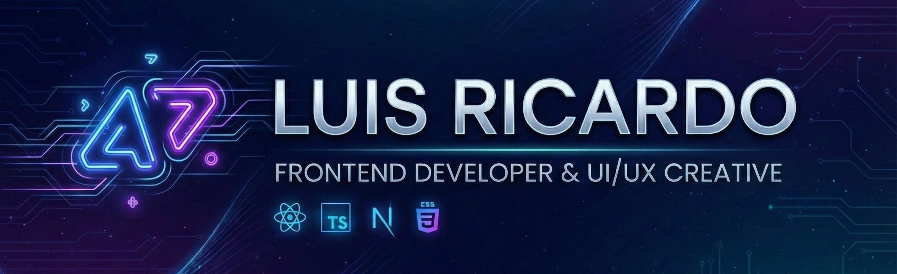

  

# 👋 Hello! I'm **Luis Ricardo**

🎨 **Frontend Developer** passionate about designing clean, usable, and modern interfaces.  
🚀 I love building dynamic digital experiences with cutting-edge technologies. 📚 Always learning, always creating.

 

&nbsp; 

---

## 🛠️ Tech Stack

### 🌐 Languages and Frontend

### ⚛️ Frameworks and Libraries

### ⚙️ Tools and Version Control

### 🔧 Methodologies and Concepts

- **Methodologies:** Scrum, Agile
- **CSS:** BEM, SMACSS, CSS Modules
- **APIs:** REST APIs (fetch/axios)
- **State Management:** Redux Toolkit
- **Additional Languages:** Java, C, C++

---

## 📂 Featured Projects

🚧 _(Coming soon - you'll add your projects here)_ 🚧

---

## 📊 GitHub Stats

---

## 📫 Contact

---

✨ _Frontend is not just code, it's user experience. My goal is to create interfaces that people enjoy using._

